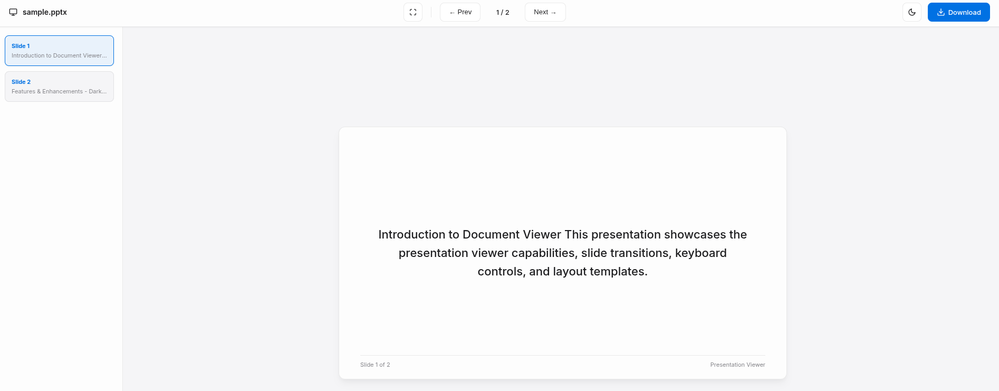
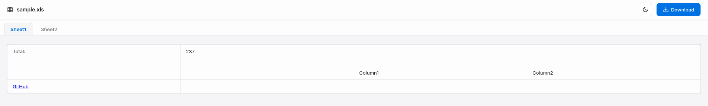
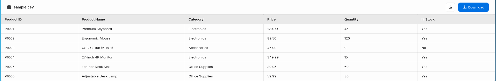

# Document Viewer

A lightweight, premium browser extension that previews documents inline with zero external dependencies. Elegant dark/light theme styling, tab-switching for spreadsheets, slide outlines for presentations, and a distraction-free reader layout for documents.

## Supported Formats
`PDF` • `DOCX` • `DOC` • `PPTX` • `PPT` • `XLSX` • `XLS` • `CSV` • `TSV` • `TXT` • `JSON` • `LOG` • `MD` • `CONF` • `INI`

## Core Highlights
*   **Modern Aesthetics**: Seamless light/dark theme transitions, premium Inter & JetBrains Mono typography, and smooth micro-animations.
*   **Reader Layout**: Center-aligned document page mimicking native e-readers for Word documents.
*   **Spreadsheet Grid**: Multi-tab worksheet navigator with sticky headers and responsive tables.
*   **Slide Decks**: 16:9 presentation canvas with sidebar thumbnails, keyboard pagination, and native HTML5 fullscreen presenter mode.
*   **Interactive Code Viewer**: Text search with matching highlights, line numbers, word-wrap, font zoom controls, and formatted JSON.
*   **Built-in Safety**: CORS network fallbacks to standard download, modifier-key bypass, and instant Blob URL memory cleanup.

## Previews & Screenshots

### Presentation Deck (PPTX)
  

### Spreadsheet (XLS/XLSX)
  

### CSV / TSV Data Table
  

## Installation
1. Navigate to `chrome://extensions` in your browser.
2. Enable **Developer mode** in the top-right corner.
3. Click **Load unpacked** in the top-left and select this repository folder.

